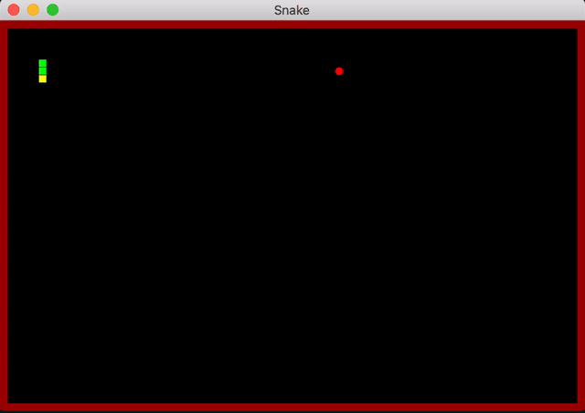

# Snake
A snake game made by C++ and SFML framework.

# Gameplay
Moving:
 - Use arrow keys to move the snake within the board.
 - Be careful not to hit the red barriers.
 
Extending body:
 - Try to eat as many as apple (red dot) on the board to extend the body.
 
Once the snake hits a red barrier, the game is over.

